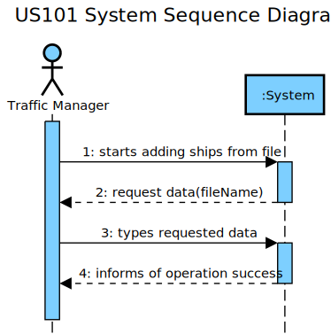

# US 101 - Import ships from file

## 1. Requirements Engineering

### 1.1. User Story Description

As a traffic manager, I which to import ships from a text file into a BST.

### 1.2. Acceptance Criteria

- **AC1:**  no data lost.

### 1.3. Found out Dependencies

No dependency to other user stories.

### 1.4. Input and Output Data

- Input Data
	- Typed data:
		 - File name hour.
	- Selected data: none
- Output Data
	- Number of ships/dynamic data imported

### 1.5. System Sequence Diagram (SSD)

## 2. OO Analysis

### 2.1. Relevant Domain Model Excerpt

## 3. Design - User Story Realization

### Systematization ##

The conceptual classes promoted to software classes are:

* Company
* Ship
* ShipDynamicData

Other software classes (i.e. Pure Fabrication) identified:

* ShipFileUI
* ShipFileController
* ShipStore

## 3.2. Sequence Diagram (SD)

### US101-SD

## 3.3. Class Diagram (CD)

## 4. Review

All the requirements and acceptance critereas were fulfilled. All functionalities have coverage tests.