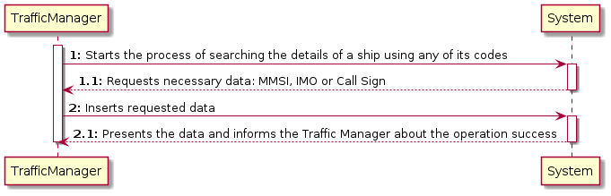
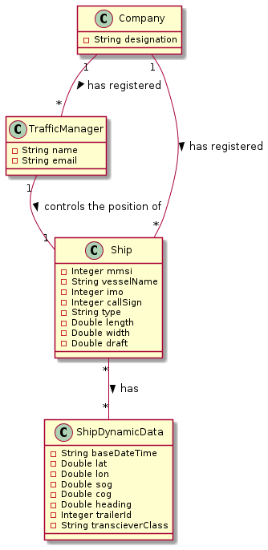
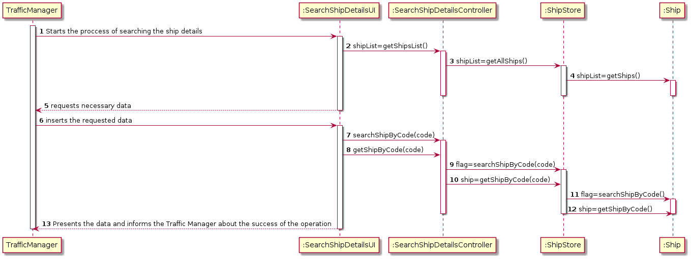
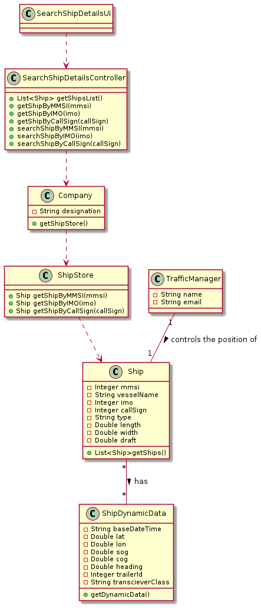

LAPR3 2021-2022 Integrative Project - Sprint 1
=============================================================================

## JIRA Issue: LAP22G99-2 ##

## [US102] As a traffic manager I which to search the details of a ship using any of its codes: MMSI, IMO or Call Sign.

Brief description: This user story’s goal is to search the details of a ship by using its MMSI, IMO or Call Sign and the decision to choose one of these codes is up to the Traffic Manager. After choosing one of the three codes, the ship´s data is presented.

## Main Actor:

Traffic Manager

## System Sequence Diagram (LAP22G99-12)

## Domain Model (LAP22G99-12)

## Sequence Diagram (LAP22G99-13)

## Class Diagram (LAP22G99-13)

## LAP22G99-14

The code and its tests are located in the src folder.

## LAP22G99-15
## Project Status:

- Project on track? [Yes/No].
  - Yes.

## Sprint Goals:

- What was planned to achieve in this US?
  - It was planned to finish all the US as well as exceed test percentages;
  - Implement a UI to login with email and password.
- Roadmap elements you wanted to target.
  - None.
- Milestones in the sprint.
  - UI to login fully implemented;
  - Functional US;
  - Test percentages exceeded.

## Status overview:

- Planned sprint items:
  - US102
- Finished and unfinished:
  - Done: US / Tests;
  - Not done: nothing.
- Added and removed items:
  - Added: UI to login
  - Removed: none.
- Changed priorities:
  - Migration from Junit 4 to Junit 5: high priority.
- Test coverage
  - 91.7%.
- How to continue with incompleted work
  - Inexistent incompleted work.

## Impediments:

- What is left to finish in unfinished tasks:
  - None unfinished tasks.
- Risks identified in the sprint:
  - None.
- Impediments identified in the sprint:
  - None.
- Organization level impediments:
  - None.
- Proposals of solutions
  - None.
