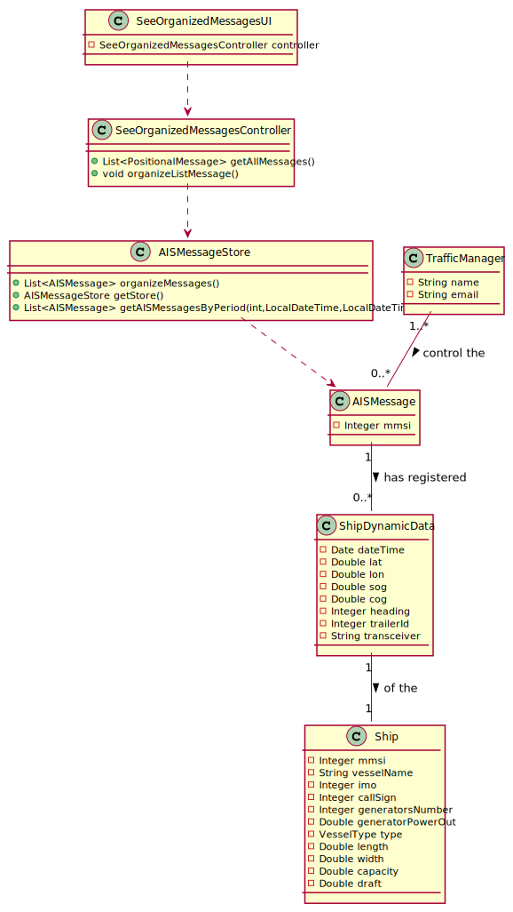

LAPR3 2021-2022 Integrative Project - Sprint 1
=============================================================================

## [US103] As a traffic manager I which to have the positional messages temporally organized and associated with each of the ships.
Brief description: This user story goal is to present to the Traffic Manager the messages of a ship in a period or date.

## Main Actor:

Traffic Manager

## System Sequence Diagram(LAP22G99-30)

## Domain Model(LAP22G99-30)

## Sequence Diagram(LAP22G99-32)

## Class Diagram(LAP22G99-32)

## Implementation(LAP22G99-34)

The code and its tests are located in the src folder. All the acceptance criteria were respect.

## Review(LAP22G99-35)

- Project on track? [Yes/No].
    - Yes.

## Sprint Goals:

- What was planned to achieve in this US?
    - It was planned to finish all the US as well as exceed test percentages;
    - Implement a UI to login with email and password.
- Roadmap elements you wanted to target.
    - None.
- Milestones in the sprint.
    - UI to login fully implemented;
    - Functional US;
    - Test percentages exceeded.

## Status overview:

- Planned sprint items:
    - US103
- Finished and unfinished:
    - Done: US / Tests;
    - Not done: nothing.
- Added and removed items:
    - Added: UI to login
    - Removed: none.
- Changed priorities:
    - Migration from Junit 4 to Junit 5: high priority.
- Test coverage
    - 91.7%.
- How to continue with incompleted work
    - Inexistent incompleted work.
    
## Impediments:

- What is left to finish in unfinished tasks:
    - None unfinished tasks.
- Risks identified in the sprint:
    - None.
- Impediments identified in the sprint:
    - None.
- Organization level impediments:
    - None.
- Proposals of solutions
    - None.