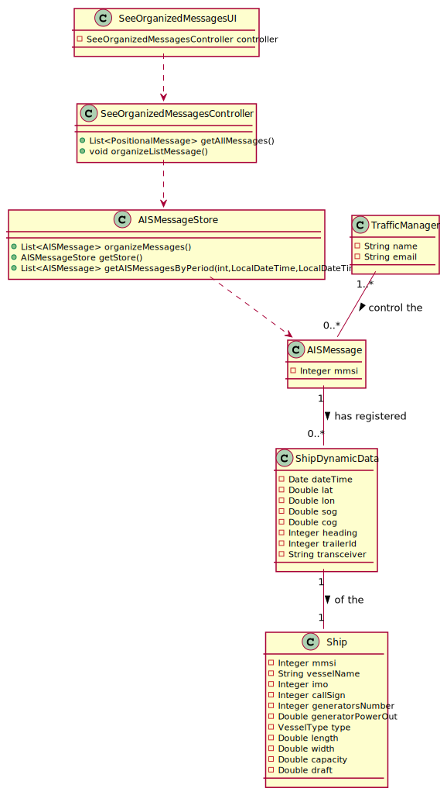

## [US103] As a traffic manager I which to have the positional messages temporally organized and associated with each of the ships.
The user story consists in searching and showing all the positional message in the system and organize them by the message's date
that were chosen by the Traffic Manager. If Messages found, the system will print a message saying that no data found. If the system
find messages that are compatible with the data introduced by the Traffic Manager he print the infos. 

For the solution the following Class Diagram developed:

### Class Diagram

### Class Diagram Explanation

SeeOrganizedMessagesUI is an user interface, that communicate with the Traffic Manager asking the data needed. Once the communication
is complete the UI makes the contact with the controller and ask the controller the data to print.

SeeOrganizedMessageController is a controller class, that have the principals methods needed to get all messages that combine with the 
data introduced by the Traffic Manager and permit the communication of the UI with system. This class have 3 method:

- organizeMessage(That organize the list of the messages by ship's MMSI, and the Date that the message was sent)

- getStore(that returns the AIS' message store)

- getAISMessageByPeriod(that returns a list of the messages that matches with the data introduced by Traffic Manager)

Traffic Manager is the class that represent the traffic manager, the user that ask the system for that messages

AIS Message is a class the store the MMSI of the ship that sent the message, and the positional values

AIS Store is where the system store all AIS messages

### Complexity Analysis

**organizeMessages** receive a list of messages, then call a Collentions' method, **sort** method,that sort the list according the compareTo method.
And this method has the Big-O time complexity is O(N*log(N)).

**getStore** returns the store in the controller, so just return the local variable. The complexity of the return is O(1).

**getAISMessagesByPeriod** makes a loop and see the messages that the data match with data received as parameter and if it matches,
it add to a list and at the end, return the list. Knowing that the complexity of the loop is O(n), so the method complexity is O(n).

