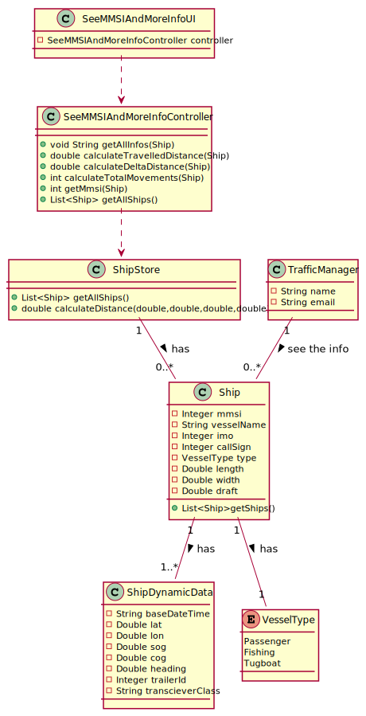

## [US105] As a traffic manager I which to have the positional messages temporally organized and associated with each of the ships.
This user story consists in searching and showing the MMSI,  the total number of movements, Travelled Distance and Delta Distance
of all the ships in the system. This US is an automatic U, that no data is need from the traffic Manager, just the order(ascending or descending),
that is presenting the options that he should choose.

For the solution the following Class Diagram developed:
### Class Diagram

### Class Diagram Explanation

SeeMMSIAndMoreInfoUI is an user interface, that communicate with the Traffic Manager asking the order that he want to see the infos.
Once the communication is complete the UI makes the contact with the controller and ask the controller the data to print, and print it.

SeeMMSIAndMoreInfoController is a controller class, that have the principals methods needed to get all the info, and permit the 
communication of the UI with system. This class have 6 method:
-getAllInfos(the function go get all the info and put it into a String and return)
-calculateTravelledDistance(calculate the the distance made by the ship and return the result)
-calculateDeltaDistance(calculate the first and last position distance and return the result)
-calculateDistance(calculate the distance between two spots using the latitude and longitude and return the result)
-calculateTotalMovements(calculate the total movements and return the result)
-getAllShips(return a list of all the ships in the system)

### Complexity Analysis
**getAllInfo** this method call the other method one time, so the complexity of this method will equal to the **calculateTravelledDistance**
because it's complexity is O(n), and the others is O(n).

**calculateTravelledDistance** this method will call the method calculateDistance, that the complexity is O(n), in the loop, so the complexity is O(n).

**getAllShips** is a method that call other method in the store class, that the complexity is O(n), because of its convert an AVL tree into a list.