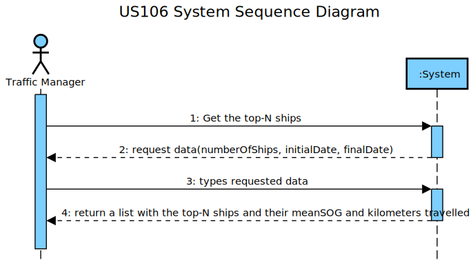
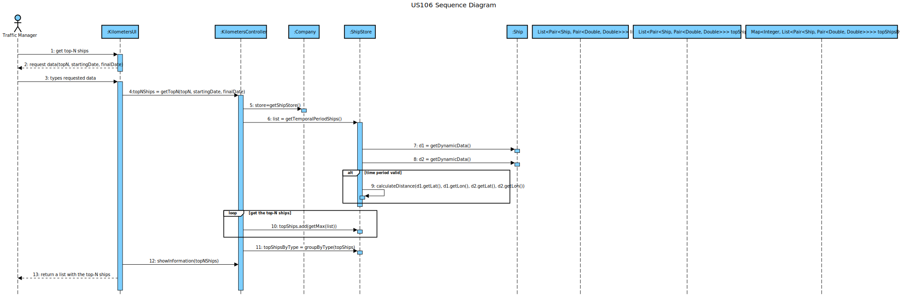
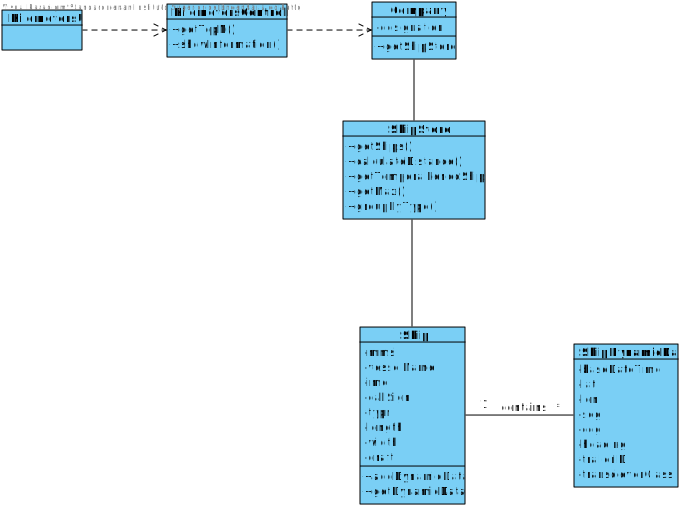

# US 106 - Get the top-N ships

## 1. Requirements Engineering

### 1.1. User Story Description

Get the top-N ships with the most kilometres travelled and their average speed
(MeanSOG).

### 1.2. Acceptance Criteria

- **AC1:**  In a period (initial/final Base Date Time) grouped by Vessel Type.

### 1.3. Found out Dependencies

US101: It must be possible to import ships in order to get the top-N ships with most distance travelled.

### 1.4. Input and Output Data

- Input Data
	- Typed data:
		 - Number of Ships, initial date and hour and final date and hour.
	- Selected data: none
- Output Data
	- Top-N ships' MMSI, travelled distance, mean SOG grouped by vessel type.

### 1.5. System Sequence Diagram (SSD)

## 2. OO Analysis

### 2.1. Relevant Domain Model Excerpt

## 3. Design - User Story Realization

### Systematization ##

The conceptual classes promoted to software classes are:

* Company
* Ship
* ShipDynamicData

Other software classes (i.e. Pure Fabrication) identified:

* KilometersUI
* KilometersController
* ShipStore

## 3.2. Sequence Diagram (SD)

## 3.3. Class Diagram (CD)

## 4. Review

All the requirements and acceptance critereas were fulfilled. All functionalities have coverage tests.