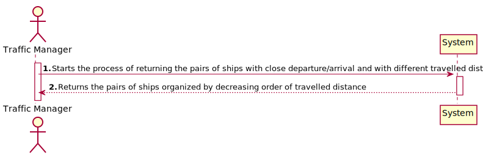
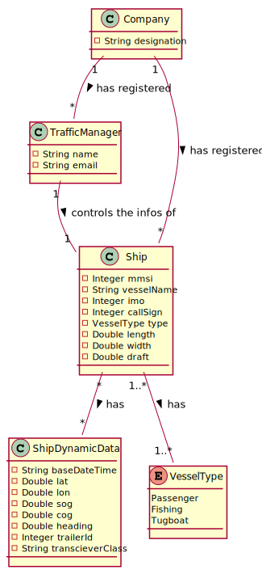
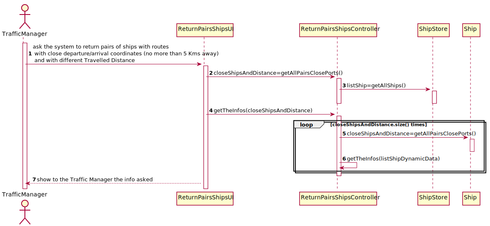
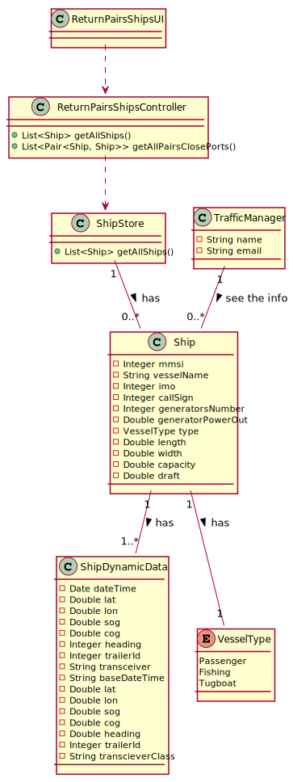

# 1. US107 - Return pairs of ships 

## 1. Requirements Engineering 

### 1.1. User Story Description

Return pairs of ships with routes with close departure/arrival coordinates (no
more than 5 Kms away) and with different Travelled Distance.

### 1.2. Acceptance Criteria

- **AC1:** Sorted by the MMSI code of the 1st ship and in descending order of the
  Travelled Distance difference.
- **AC2:** Do not consider ships with Travelled Distance less than 10 kms.

### 1.3. Found out dependencies

### 1.4. Input and Output Data

- Input Data
    - Typed data:
        - Departure and Arrival coordinates of the ships, Travelled Distance
    - Selected data: none
- Output Data
    - MMSI code, Departure and Arrival coordinates of the ships, Travelled Distance Difference

### 1.5. System Sequence Diagram (SSD)

## 2. OO Analysis

### 2.1. Relevent Domain Model Excerpt

## 3. Design - User Story Realization

### Systematization ##

The conceptual classes promoted to software classes are:
* Company
* Ship
* ShipDynamicData

Other software classes (i.e. Pure Fabrication) identified:
* ReturnPairsShipsUI
* ReturnPairsShipsController
* ShipStore

### 3.2. Sequence Diagram (SD)

### 3.3. Class Diagram (CD)

