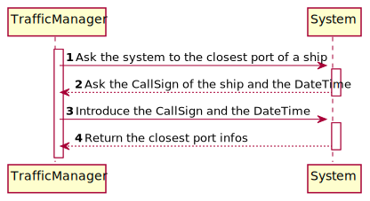
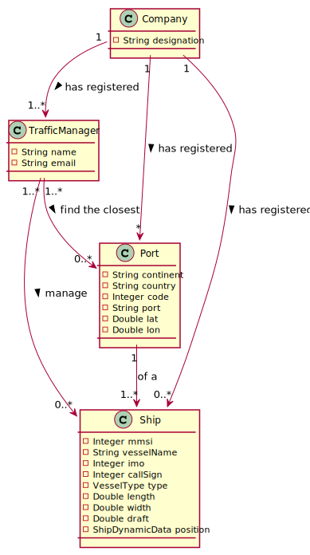
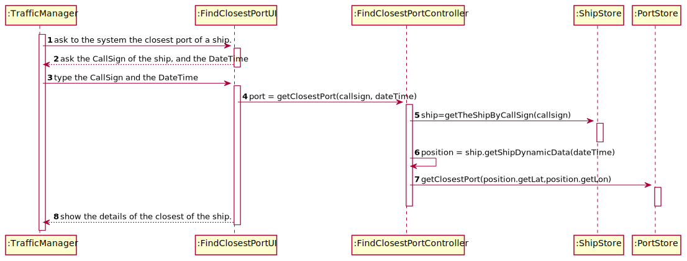
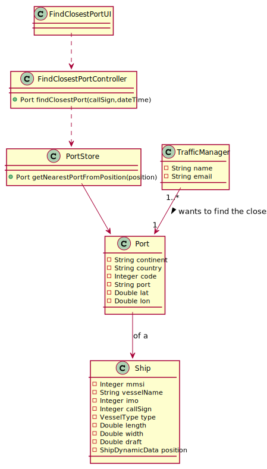

LAPR3 2021-2022 Integrative Project - Sprint 2
=============================================================================

## JIRA Issue: LAP22G99-53 ##

## [US202] As a Traffic manager, I which to find the closest port of a ship given its CallSign, on a certain DateTime. 

Brief description: This user story’s goal is to find the nearest port from a ship in certain DateTime. So the user store 
is successful when the system have the position of the ship in the giving datetime, and exist ports registed in the system.

## Main Actor:

Traffic Manager

## System Sequence Diagram (LAP22G99-68)

## Domain Model (LAP22G99-68)

## Sequence Diagram (LAP22G99-69)

## Class Diagram (LAP22G99-69)

## LAP22G99-70

The code and its tests are located in the src folder.

## LAP22G99-71
## Project Status:

- Project on track? [Yes/No].
  - Yes.

## Sprint Goals:

- What was planned to achieve in this US?
  - It was planned to finish all the US as well as exceed test percentages;
  - Connect to a database;
  - Use the 2D-Tree to find the nearest position.
- Roadmap elements you wanted to target.
  - None.
- Milestones in the sprint.
  - 2D-Tree fully implemented;
  - Functional US;
  - Test percentages exceeded.

## Status overview:

- Planned sprint items:
  - US202
- Finished and unfinished:
  - Done: US / Tests;
  - Not done: nothing.
- Added and removed items:
  - Added: 2D-Tree
  - Removed: none.
- Changed priorities:
  - None.
- Test coverage
  - 100%.
- How to continue with incompleted work
  - Inexistent incompleted work.

## Impediments:

- What is left to finish in unfinished tasks:
  - None unfinished tasks.
- Risks identified in the sprint:
  - None.
- Impediments identified in the sprint:
  - None.
- Organization level impediments:
  - None.
- Proposals of solutions
  - None.