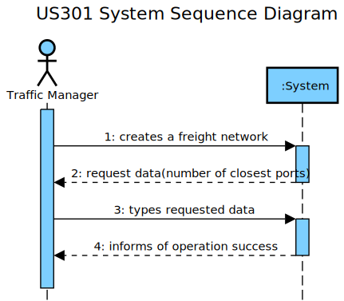

LAPR3 2021-2022 Integrative Project - Sprint 3
=============================================================================

## JIRA Issue: LAP22G99-122 ##

## [US301] As a Traffic manager, I which to import data from countries, ports, borders and 
seadists from the database to build a freight network. 
▪ The capital of a country has a direct connection with the capitals of the 
  countries with which it borders. The ports of a country, besides connecting with all the ports of the same country, the port closest to the 
  capital of the country connects with it; and finally, each port of a country 
  connects with the n closest ports of any other country.
▪ The calculation of distances in Kms between capitals, and ports and 
capitals must be done using the GPS coordinates.
▪ The graph must be implemented using the adjacency matrix 
representation and ensuring the indistinct manipulation of capitals and 
seaports

## Main Actor:

Traffic Manager

## System Sequence Diagram (LAP22G99-142)

## Domain Model (LAP22G99-142)

## Sequence Diagram (LAP22G99-143)

## Class Diagram (LAP22G99-143)

## LAP22G99-70

The code and its tests are located in the src folder.

## LAP22G99-144
## Project Status:

- Project on track? [Yes/No].
    - Yes.

## Sprint Goals:

- What was planned to achieve in this US?
    - It was planned to finish all the US as well as exceed test percentages;
    - To lead with some exceptions that could be achieved.
- Roadmap elements you wanted to target.
    - None.
- Milestones in the sprint:
    - Functional US;
    - Test percentages exceeded.

## Status overview:

- Planned sprint items:
    - US301
- Finished and unfinished:
    - Done: US / Tests;
    - Not done: nothing.
- Added and removed items:
    - Added: VertexLocation became superclass.
    - Removed: none.
- Changed priorities:
    - None.
- Test coverage
    - 100%.
- How to continue with incompleted work
    - Inexistent incompleted work.

## Impediments:

- What is left to finish in unfinished tasks:
    - None unfinished tasks.
- Risks identified in the sprint:
    - None.
- Impediments identified in the sprint:
    - None.
- Organization level impediments:
    - None.
- Proposals of solutions
    - None.