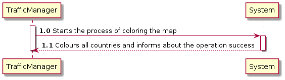
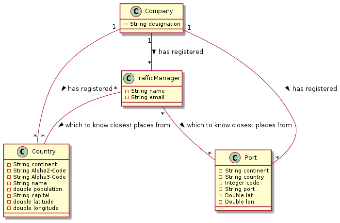
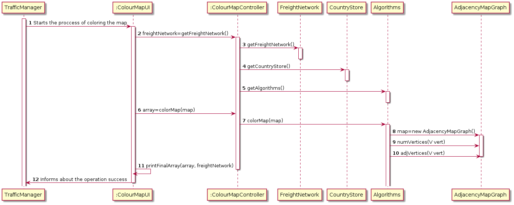
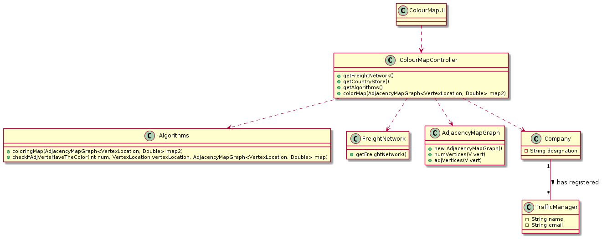

LAPR3 2021-2022 Integrative Project - Sprint 3
=============================================================================

## JIRA Issue: LAP22G99-123 ##

## [US201] As a Traffic manager I wish to colour the map using as few colours as possible.

Brief description: This user story’s goal is to colour a map using as few colours as possible and making sure that neighbours countries don´t have the same colour.

## Main Actor:

Traffic Manager

## System Sequence Diagram (LAP22G99-146)

## Domain Model (LAP22G99-146)

## Sequence Diagram (LAP22G99-147)

## Class Diagram (LAP22G99-147)

## LAP22G99-148

The code and its tests are located in the src folder.

## LAP22G99-149
## Project Status:

- Project on track? [Yes/No].
  - Yes.

## Sprint Goals:

- What was planned to achieve in this US?
  - It was planned to finish all the US as well as exceed test percentages;
  - Colour a map;
- Roadmap elements you wanted to target.
  - None.
- Milestones in the sprint.
  - Map coloured;
  - Functional US;
  - Test percentages exceeded.

## Status overview:

- Planned sprint items:
  - US302
- Finished and unfinished:
  - Done: US / Tests;
  - Not done: nothing.
- Added and removed items:
  - Added: Map
  - Removed: none.
- Changed priorities:
  - None.
- Test coverage
  - 90.1%.
- How to continue with incompleted work
  - Inexistent incompleted work.

## Impediments:

- What is left to finish in unfinished tasks:
  - None unfinished tasks.
- Risks identified in the sprint:
  - None.
- Impediments identified in the sprint:
  - None.
- Organization level impediments:
  - None.
- Proposals of solutions
  - None.
