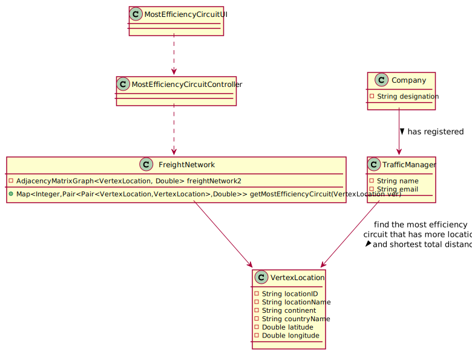

LAPR3 2021-2022 Integrative Project - Sprint 4
=============================================================================

## JIRA Issue: LAP22G99-197 ##

## [US403] US403 - As a Traffic manager I wish to know the most efficient circuit that starts from a source location and visits the greatest number of other locations once, returning to the starting location and with the shortest total distance.
Brief description: This user story’s goal is find the most efficiency circuit from a source location. 

## Main Actor:

Traffic Manager

## System Sequence Diagram (LAP22G99-218)

## Domain Model (LAP22G99-218)

## Sequence Diagram (LAP22G99-219)

## Class Diagram (LAP22G99-219)

## LAP22G99-220

The code and its tests are located in the src folder.

## LAP22G99-221
## Project Status:

- Project on track? [Yes/No].
    - Yes.

## Sprint Goals:

- What was planned to achieve in this US?
    - It was planned to finish all the US as well as exceed test percentages;
    - To lead with some exceptions that could be achieved.
- Roadmap elements you wanted to target.
    - None.
- Milestones in the sprint:
    - Functional US;
    - Test percentages exceeded.

## Status overview:

- Planned sprint items:
    - US403
- Finished and unfinished:
    - Done: US / Tests;
    - Not done: nothing.
- Added and removed items:
    - Added: Fleury's algorithm.
    - Removed: none.
- Changed priorities:
    - None.
- Test coverage
    - 86%.
- How to continue with incompleted work
    - Inexistent incompleted work.

## Impediments:

- What is left to finish in unfinished tasks:
    - None unfinished tasks.
- Risks identified in the sprint:
    - None.
- Impediments identified in the sprint:
    - None.
- Organization level impediments:
    - None.
- Proposals of solutions
    - None.