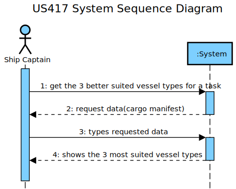
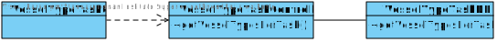

LAPR3 2021-2022 Integrative Project - Sprint 4
=============================================================================

## JIRA Issue: LAP22G99-211 ##

## [US417] As the Ship Captain I want the technical team to search for at least three types of 
ship/vessels that are better suited to the task (e.g., depending on the type of cargo), in 
which the “control” bridge can assume three positions, one in the bow, one in the stern, 
and finally in the midship.
## Main Actor:

Ship Captain

## System Sequence Diagram (LAP22G99-211)

## Domain Model (LAP22G99-211)

## Sequence Diagram (LAP22G99-211)

## Class Diagram (LAP22G99-211)

## LAP22G99-211

The code and its tests are located in the src folder.

## LAP22G99-211
## Project Status:

- Project on track? [Yes/No].
    - Yes.

## Sprint Goals:

- What was planned to achieve in this US?
    - It was planned to finish all the US as well as exceed test percentages;
    - To lead with some exceptions that could be achieved.
- Roadmap elements you wanted to target.
    - None.
- Milestones in the sprint:
    - Functional US;
    - Test percentages exceeded.

## Status overview:

- Planned sprint items:
    - US417
- Finished and unfinished:
    - Done: US / Tests;
    - Not done: nothing.
- Added and removed items:
    - Added: VertexLocation became superclass.
    - Removed: none.
- Changed priorities:
    - None.
- Test coverage
    - 100%.
- How to continue with incompleted work
    - Inexistent incompleted work.

## Impediments:

- What is left to finish in unfinished tasks:
    - None unfinished tasks.
- Risks identified in the sprint:
    - None.
- Impediments identified in the sprint:
    - None.
- Organization level impediments:
    - None.
- Proposals of solutions
    - None.