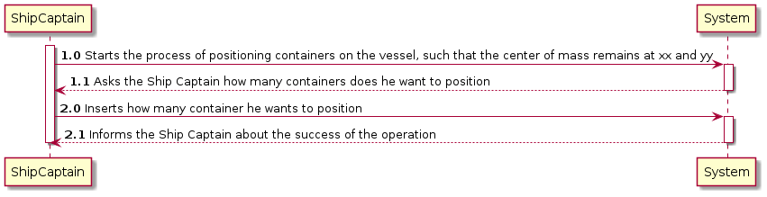
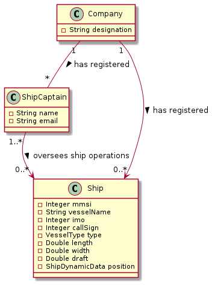
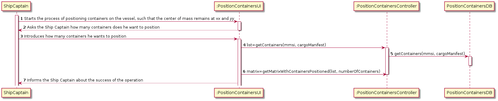
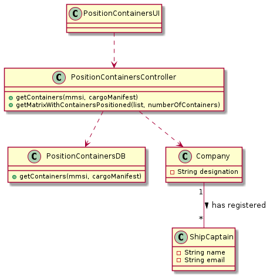

LAPR3 2021-2022 Integrative Project - Sprint 4
=============================================================================

## JIRA Issue: LAP22G99-216 ##

## [US419] As the Ship Captain I want to know where to position, for example, one hundred (100) containers on the vessel, such that the center of mass remains at xx and yy, determined in the previous point.

Brief description: This user story’s goal is to know where to position a certain number of containers such that the center of mass remains at xx and zz.

## Main Actor:

Ship Captain

## System Sequence Diagram (LAP22G99-235)

## Domain Model (LAP22G99-235)

## Sequence Diagram (LAP22G99-236)

## Class Diagram (LAP22G99-236)

## LAP22G99-237

The code and its tests are located in the src folder.

## LAP22G99-238
## Project Status:

- Project on track? [Yes/No].
  - Yes.

## Sprint Goals:

- What was planned to achieve in this US?
  - It was planned to finish all the US as well as exceed test percentages;
  - Know where to position containers such that the center of mass remains at xx and zz;
- Roadmap elements you wanted to target.
  - None.
- Milestones in the sprint.
  - Known where to position containers;
  - Functional US;
  - Test percentages exceeded.

## Status overview:

- Planned sprint items:
  - US419
- Finished and unfinished:
  - Done: US / Tests;
  - Not done: nothing.
- Added and removed items:
  - Added: Map
  - Removed: none.
- Changed priorities:
  - None.
- Test coverage
  - 90.1%.
- How to continue with incompleted work
  - Inexistent incompleted work.

## Impediments:

- What is left to finish in unfinished tasks:
  - None unfinished tasks.
- Risks identified in the sprint:
  - None.
- Impediments identified in the sprint:
  - None.
- Organization level impediments:
  - None.
- Proposals of solutions
  - None.
