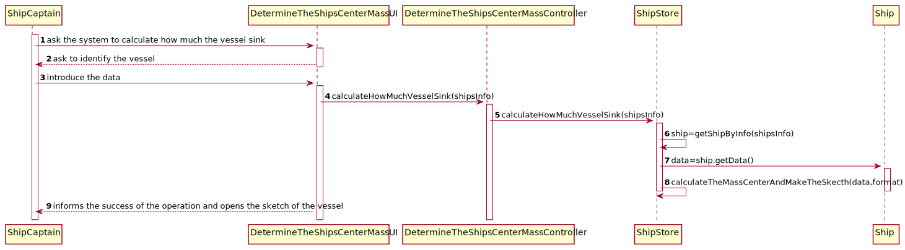

LAPR3 2021-2022 Integrative Project - Sprint 2
=============================================================================

## JIRA Issue: LAP22G99-124 ##

## [US420] As the Ship Captain I want to know for a specific vessel, how much did thevessel sink, assuming that each container has half a ton of mass.
Brief description: This user story’s goal is to find how much the vessel sink. 

## Main Actor:

Ship Captain

## System Sequence Diagram (LAP22G99-226)

## Domain Model (LAP22G99-226)

## Sequence Diagram (LAP22G99-227)

## Class Diagram (LAP22G99-227)

## LAP22G99-228

The code and its tests are located in the src folder.

## LAP22G99-229
## Project Status:

- Project on track? [Yes/No].
    - Yes.

## Sprint Goals:

- What was planned to achieve in this US?
    - It was planned to finish all the US as well as exceed test percentages;
    - To lead with some exceptions that could be achieved.
- Roadmap elements you wanted to target.
    - None.
- Milestones in the sprint:
    - Functional US;
    - Test percentages exceeded.

## Status overview:

- Planned sprint items:
    - US420
- Finished and unfinished:
    - Done: US / Tests;
    - Not done: nothing.
- Added and removed items:
    - Removed: none.
- Changed priorities:
    - None.
- Test coverage
    - 90.1%.
- How to continue with incompleted work
    - Inexistent incompleted work.

## Impediments:

- What is left to finish in unfinished tasks:
    - None unfinished tasks.
- Risks identified in the sprint:
    - None.
- Impediments identified in the sprint:
    - None.
- Organization level impediments:
    - None.
- Proposals of solutions
    - None.